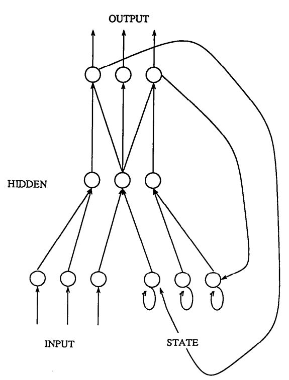
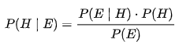

# Assignment 3: Investigate a methodology

## Introduction
The fall of the Soviet Union forced Russia to undergo new transformations that would yield unknown problems for the new democracy. In the 1990s, the Russian Federation started as a mid-income country on par with modern Mexico. The measure of Russian GDP had largely comprised of unfinished construction projects, consumables with no demand, and vast quantities of military goods. (Shleifer & Treisman, 2005) The modern measure of a countries GDP is based on a distribution of GDP per capita. This method only shows a gross number of products and services produced and does not distinguish how transactions add to societal well-being or reduce it. An average distribution across a population does not accurately depict a realistic situation in the real world. The fact of the matter is that countries contain diverse regions of peoples that all experience different hardships on a day-to-day basis. While there are some afflictions that affect total populations like disease and war, there are a many socio-economic and concentrated ecological problems that are different for each group of people. This is especially true for countries such as Russia that have many climatic zones and a geographically separated population. Therefore, a general method of calculating a populations standard of living using national averages does not accurately depict the true situation of a populations struggles. There are too many variables that are dependent on various things that differ throughout countries.

## Inquiry type:	

An exploratory approach to the application of a machine learning method that could combine inputs from a multitude of factors and calculate a more accurate picture of living standards in a diverse region is what I am focusing on. The application of a neural network or a Bayesian model to this problem represents an opportunity to summarize problem identification into a singular entity. The methodology starts with an accurate selection of inputs in the form of variables that represent tangible objects like transportation and food chain infrastructure as well as conceptual variables such as public sentiment and traditional values. Those inputs would then be evaluated and categorized by importance of which the machine learning method would be trained. The accuracy of input data is the first step in the building of an accurate set of data that represents standards of living that can be applied to a graphical interface allowing for swift identification of areas in need.

## Method 1: Neural Networks

Neural networks are machine learning programs inspired by the biology of a brain. Much like the interconnectedness of neurons in a brain. A neural net works by feeding data inputs into trained, interconnected, layered nodes. A layer of nodes receives an input from the layer beneath it and assigns a weighted number associated with a desired outcome, then passes that data to multiple nodes above it which repeat the process until the end criteria is met. Each weight assignment is made at random at the initial start of the program. A range of values is set for each of the nodes that serve as threshold criteria to pass to the next layer. Weights and threshold values are constantly adjusted to product consistent results. (Hardesty, 2017) This explanation represents a feed forward neural network (FFNNs). This network can theoretically always model the relationship between input and output given enough neurons(nodes). 

This an illustration of a simple feed forward neural network

A recurrent neural network (RNNs) is a FFNN with enhancements. Nodes are connected through passes of the program. Information is fed from the previous layer and from the same node of a pervious pass. This method could serve to identify connections between indicators that are not apparent to a strait forward method of analysis. (Van Veen & Leijen, 2019) RNNs are often used in applications that advance and complete information such as autocompletion. An application such as this to living standard data could be used to predict the ‘missing letters’ that could advance human development. Neural nets as a whole also allow for vast troves of data to be collected and used in conjunction with one another. A problem arises in entire datasets of indicators would have to be compressed into single variables. The compression of this data might open the possibility for points to be lost to an expansive list of points thus limiting the accuracy of the prediction. In essence, the method would be handicapped by its size.

 

These illustrate the recurrent nerual network method framework

## Method 2: 

A Bayesian model is a statistical method where probability is used to represent uncertainty within a model using Bayes’ rule. This method updates the probability of an initial hypothesis as more evidence and information becomes available. 

-H is the hypothesis that may be influenced by the data- what is the outcome we are looking for?

-P(H) is the prior probability or estimate of the probability of the hypothesis before the data E is observed- what is the initial likelihood of the hypothesis?

-E or evidence is new data that was not used in computing prior probability- data that influences the initial prediction

-P(H,E) is the posterior probability or the probability of H given E- what we want to know

-P(E,H) is the probability of E based on H or likelihood. The function is a function of E- a model that describes the data

-P(E) is the marginal likelihood or model evidence. This is the same for all hypotheses being tested

Using this statistical method in the analysis of trends between living standard indicators we can find evidence in events that directly correlate with each other. A Bayesian model is a tool for inferring the probability of events occurring based on initial parameters. The accuracy of this method would be dependent on the accuracy of the initial data collected. Since the inputs of this method are selected by hand there is room for human bias to skew results. A random selection of evidence would control for this variable, but would not be all encompassing.

## Further Study

Both aforementioned methods are powerful tools for identifying trends within sets of data. An exploration into how both methods could be combined into one neural network based on a pseudo-Bayesian model to identify the most likely of indicators that are the most closely linked would be an interesting course of research. A mix of the two methods would allow for a non-biased selection of living standard indicators and power a tool that can be adapted for many purposes. 
  
## Citations

1. Bayesian Spatial Modeling. (n.d.). Retrieved April 19, 2020, from http://gispopsci.org/bayesian-spatial-modeling/

2. Elman, J. L. (1990). Finding Structure in Time. Cognitive Science, 14(2), 179–211. doi: 10.1207/s15516709cog1402_1

3. Hardesty, L. (2017, April 14). Explained: Neural networks. Retrieved from http://news.mit.edu/2017/explained-neural-networks-deep-learning-0414

4. Shleifer, A., & Treisman, D. (2005). A Normal Country: Russia After Communism. Journal of Economic Perspectives, 19(1), 151–174.
Van Veen, F. & Leijnen, S. (2019). The Neural Network Zoo. Retrieved from https://www.asimovinstitute.org/neural-network-zoo

